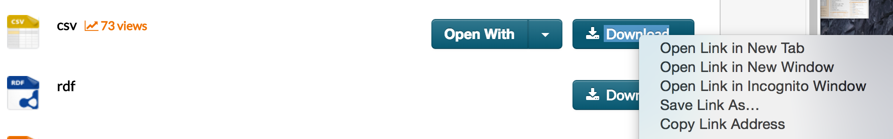

<br><br>

First, you'll need to load the `RCurl` package. If you've never used this package before, you'll want to install it from it's [CRAN page](https://cran.r-project.org/web/packages/RCurl/index.html)

```{r, collapse=TRUE}
if(!require(RCurl)) install.packages("RCurl") # If missing package, install from CRAN
```

<br>

***

## Steps

Instead of downloading the dataset manually, right-click on the download option and copy the *Link Address*. You can plug this directly into the `getURL()` function from RCurl. 



```{r}
## Use RCurl to download the dataset from medicare.gov API 
url <- getURL("https://data.medicare.gov/api/views/c7us-v4mf/rows.csv?accessType=DOWNLOAD")
```


<br>


Since the url object is the csv file as a string, we'll use `textConnection(url)` to read the results as a text file. Finally, we use the `read.csv()` function to read the connection into R.

```{r}
# Read in the CSV  as a csv 
hosp <- read.csv(file = textConnection(url))
str(hosp)
```

<br><br><br>

<table style="background-color: #f0f0f0;padding: 3; width: 100%">
<tr><td>
### Contact
</td></tr>
<tr><td>

**Hunter Ratliff**

Email: hunterratliff1@gmail.com   
Twitter: @[HunterRatliff1](https://twitter.com/HunterRatliff1)   
Github: [HunterRatliff1](https://github.com/hunterratliff1)   
RPubs: [HunterRatliff1](rpubs.com/HunterRatliff1)   

</td></tr>
<tr><td>
```
Copyright (C) 2015 Hunter Ratliff

This program is free software: you can redistribute it and/or modify
it under the terms of the GNU General Public License as published by
the Free Software Foundation, either version 3 of the License, or
(at your option) any later version.

This program is distributed in the hope that it will be useful,
but WITHOUT ANY WARRANTY; without even the implied warranty of
MERCHANTABILITY or FITNESS FOR A PARTICULAR PURPOSE.  See the
GNU General Public License for more details.

You should have received a copy of the GNU General Public License
along with this program.  If not, see <http://www.gnu.org/licenses/>.


```
</td></tr></table>

This is an R Markdown document. Markdown is a simple formatting syntax for authoring HTML, PDF, and MS Word documents. For more details on using R Markdown see <http://rmarkdown.rstudio.com>.
